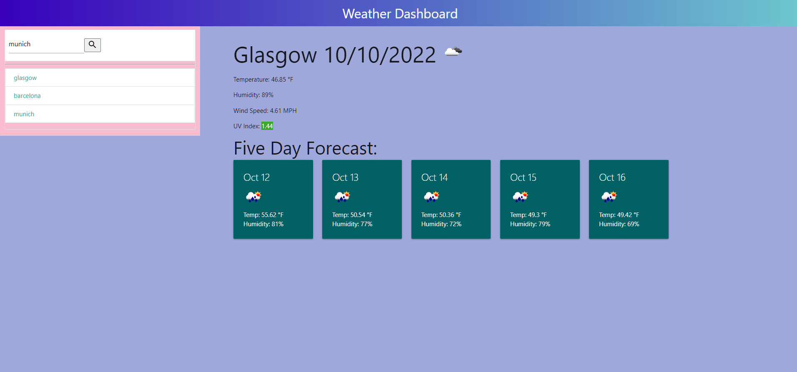

# weather-dashboard
Uses OpenWeather One call API to display results in a personalized way

## Site Demo Picture

## Site Links

* [Github](https://github.com/a-ens/weather-dashboard)
* [Deployed](https://a-ens.github.io/weather-dashboard/)